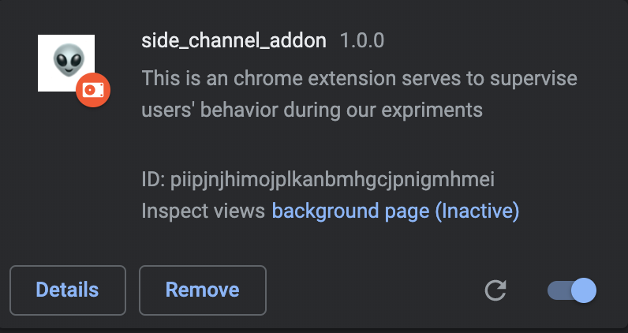

# little_Chrome_extension

a simple Chrome extension to detect users' behavior


### configuration

#### test page

to enable the sending of message, the test page should contain :

```javascript
chrome.runtime.sendMessage(targetExtensionId, {type: 'MsgFromPage', msg: 'Hello, I am page~'}, function(response) {
  		console.log(response);
		});
```

the targetExtensionId can be found in Chrome extension page:




#### manifest.json

```javascript
"externally_connectable": {
    // the address should be modified to our test page address
    "matches": ["http://3.221.81.120/test/new.html"]
  },
```

